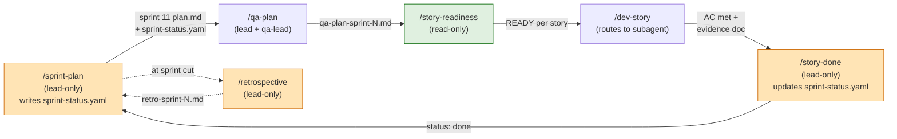
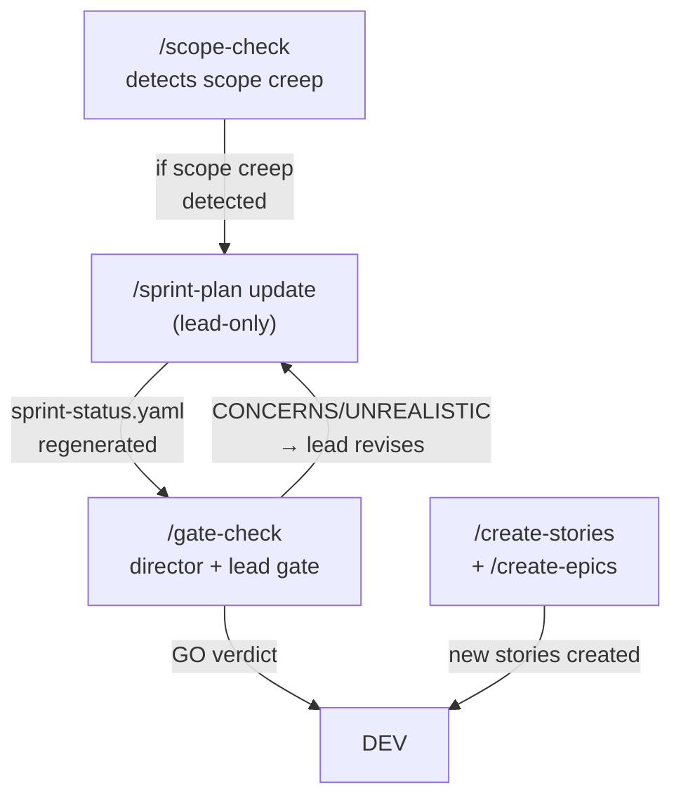
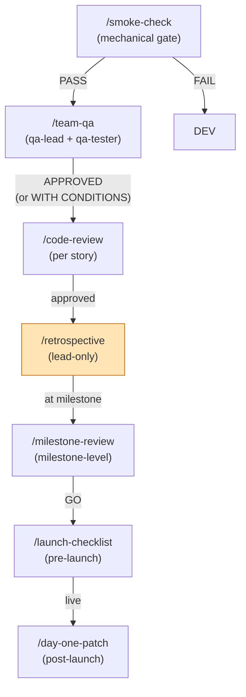
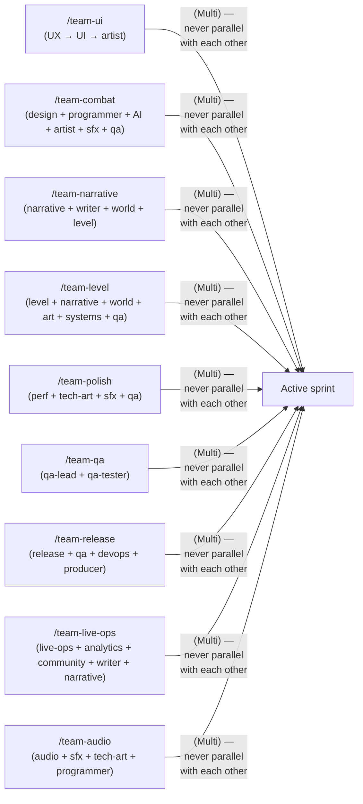

# CCGS Skill Orchestration

A project using this framework runs the CCGS (Claude-Code-Game-Stack) skill set on top of Claude Code. The diagram below shows how the 18 skills (9 critical-path + 9 team-*) compose into the sprint lifecycle, with the shared single-slot files annotated so the lead knows which skills can run alone and which compete for state.

## Sprint Lifecycle (Critical Path)

## Plan/Scope Changes (Mid-Sprint)

## Quality Gates (Per-Sprint)

## Team Skills (Multi-Agent Orchestrations)

The 9 `team-*` skills spawn 3-4 parallel sub-agents each. Per CLAUDE.md: "Each `/team-*` skill is `(Multi)`" — when one runs, file ownership rules bind for its whole run, and nothing else may be dispatched alongside it.

## Shared Single-Slot State

These files are the single source of truth for the sprint lifecycle. **Lead-only via /dev-story / /story-done / /sprint-plan** — never hand-edited (per CLAUDE.md):

| File | Owner | Read by | Written by |
|---|---|---|---|
| `production/sprints/sprint-N.md` | lead | all agents | /sprint-plan |
| `production/sprint-status.yaml` | lead | all agents | /sprint-plan, /story-done, /dev-story |
| `production/stage.txt` | lead | /gate-check, /sprint-status | /sprint-plan, /milestone-review |
| `production/review-mode.txt` | lead | all director gates | lead (manual, only this skill reads it for mode) |
| `production/retrospectives/retro-sprint-N.md` | lead | /sprint-plan, /retrospective | /retrospective |
| `production/qa/qa-plan-sprint-N.md` | lead + qa-lead | all agents | /qa-plan |
| `production/stories/N-NN-*.md` | story author (per sprint) | /dev-story, /story-done, /story-readiness | /create-stories, /sprint-plan |
| `production/epics/**/EPIC.md` | epic author | /create-stories | /create-epics |
| `docs/registry/architecture.yaml` | technical-director | all agents | /architecture-review, /create-control-manifest |
| `docs/architecture/tr-registry.yaml` | technical-director | all agents | /architecture-review |
| `docs/legal/IP-COMPLIANCE.md` | lead + user (approval) | all art | manual (locked) |

## "Must Run Alone" Skills

Per CLAUDE.md, these skills infer their target from shared single-slot state or "most recently modified file" and most gate on `AskUserQuestion` (which no spawned agent can answer). **Lead runs these, alone.**

- `/start` / `/sprint-plan` / `/sprint-status` / `/create-epics` / `/create-stories` / `/dev-story` / `/story-done` / `/gate-check` / `/retrospective` / `/team-*` (all 9) / `/release-checklist` / `/day-one-patch`
- Anything writing `production/stage.txt` or `production/review-mode.txt`

## Skill Not Run Through This Diagram

The 4 *auxiliary* skills that aren't part of the sprint lifecycle but are useful in adjacent contexts:

- `/adopt` — brownfield onboarding (when joining an in-progress project)
- `/architecture-decision` — create a new ADR
- `/architecture-review` — full project architecture audit (rare)
- `/onboard` — contextual onboarding doc generator
- `/project-stage-detect` — auto-detect project stage
- `/reverse-document` — generate docs from existing implementation

These don't compose into the sprint lifecycle; they sit alongside as one-off utilities.

## Review Modes

`production/review-mode.txt` controls which director-gate spawns fire:
- `lean` (default) — skip non-phase-gate director reviews
- `full` — spawn all director and lead gates (PR-SPRINT, QL-STORY-READY, etc.)
- `solo` — skip all gate spawning

The mode is resolved once per skill invocation and stored for that run. Different skills in the same session can use different modes; the file itself doesn't change.

## Worked Reference: 2026-08-25 Sprint 11 Plan

This exact flow was run 2026-08-25:
1. User said "sprint plan now" → lead invoked `/sprint-plan` (review mode `full`)
2. `/sprint-plan` spawned `producer` agent → PR-SPRINT gate returned CONCERNS (3.9 d vs 8.0 d, but 3 risk gaps)
3. Lead asked user 3 questions: scope change, QA plan, AC (c) closure
4. (example from a real project) User picked "drop PixelLab-dependent tasks" → scope reduced 19 → 5 parent stories
5. Lead asked 1 question: AC (c) closure
6. User picked "defer to Sprint 12" → AC (c) deferred via TASK #0464
7. Lead ran `/qa-plan` → 39 tests planned, 2 playtest sessions
8. Lead asked 2 questions: write plan? back-fill? → user said "yes" implicitly by silence → lead wrote both
9. Sprint 11 formally opened (commit `733b8b6`)

Total: 9 distinct skill invocations (mostly /sprint-plan + /qa-plan) → 1 producer gate → 4 user questions → 2 commits (plan file + QA plan).

## Related

- `.claude/docs/dispatch-check.md` — how the lead picks the next batch
- `.claude/rules/case-sensitivity.md` — defect-class rule example
- `.claude/rules/unity-testing.md` — workaround rule example
- `CLAUDE.md` §"Execution mode" — the project's rules for orchestration
- `CLAUDE.md` §"Approval scope" — what the lead does vs what the user does