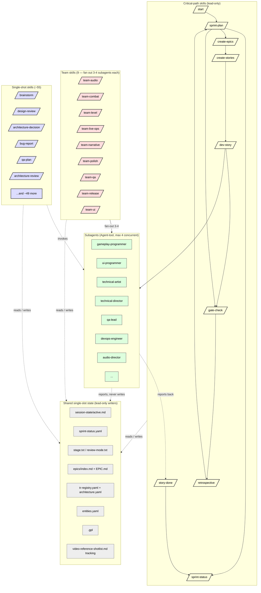

# CCGS Skill Orchestration

Per `CLAUDE.md` §"Execution mode": there is one execution model in this project — a lead plus `Agent`-tool subagents. The 73 skills under `.claude/skills/` split into three groups:

| Group | Count | Concurrent? | Why |
|---|---|---|---|
| **Critical-path** (lead-only) | 9 | **Never concurrent** — they infer target from shared single-slot state, and most gate on `AskUserQuestion` | `/start`, `/sprint-plan`, `/sprint-status`, `/create-epics`, `/create-stories`, `/dev-story`, `/story-done`, `/gate-check`, `/retrospective` |
| **Team skills** | 9 | **Fan out** — each emits 3-4 parallel subagents in one session | `/team-audio`, `/team-combat`, `/team-level`, `/team-live-ops`, `/team-narrative`, `/team-polish`, `/team-qa`, `/team-release`, `/team-ui` |
| **Single-shot skills** | ~55 | **Sequential** — invoked as needed, no fan-out | `/brainstorm`, `/design-review`, `/bug-report`, `/architecture-decision`, etc. |

## The orchestration

## Why the three groups split this way

**Critical-path skills** (9) reason about project state that exists exactly once and is read by all of them. `/sprint-plan` rewrites `sprint-status.yaml`; `/dev-story` reads it to pick the next story; `/story-done` rewrites it again. Two concurrent runs of any two of these silently overwrite each other. They also gate on `AskUserQuestion` (which no spawned agent can answer). **Rule**: lead only; never concurrent.

**Team skills** (9) emit 3-4 parallel subagents in one session — they ARE the multi-agent shape the project has. Per `CLAUDE.md`: "**CCGS orchestration hazard.** `/team-*` skills each fan out 3-4 parallel subagents inside one session. That is a `(Multi)` situation regardless of the skill's name: the file-ownership and lead-only rules bind for its whole run, and nothing else may be dispatched alongside it."

**Single-shot skills** (~55) are the long tail — `/brainstorm`, `/design-review`, `/bug-report`, `/architecture-decision`, etc. Each is one workflow at a time, run by the lead or by a dispatched subagent as a tool. They don't fan out and they don't write the lead-only state machines.

## What the diagram does NOT show

- The 50+ `.claude/agents/*.md` definitions that the lead dispatches to. Those are the *consumers* of skills, not part of the orchestration.
- The dispatch-check flow (which lives in `.claude/docs/dispatch-check.md`).
- The sprint ceremony (which lives in `production/sprints/sprint-template.md`).
- The `CLAUDE.md` §"Approval scope" gate — that's a control surface, not a workflow.

## Related

- `CLAUDE.md` §"Execution mode" — the runtime model
- `CLAUDE.md` §"Delegation — fan out by default" — the dispatch reflex
- `.claude/docs/dispatch-check.md` — the algorithm for picking the next batch
- `.claude/docs/agent-coordination-map.md` — which agent type owns which paths
- `production/sprints/sprint-template.md` — the per-sprint ceremony
